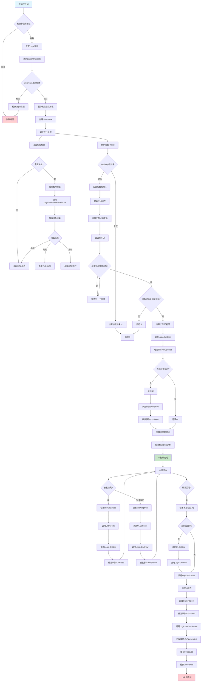
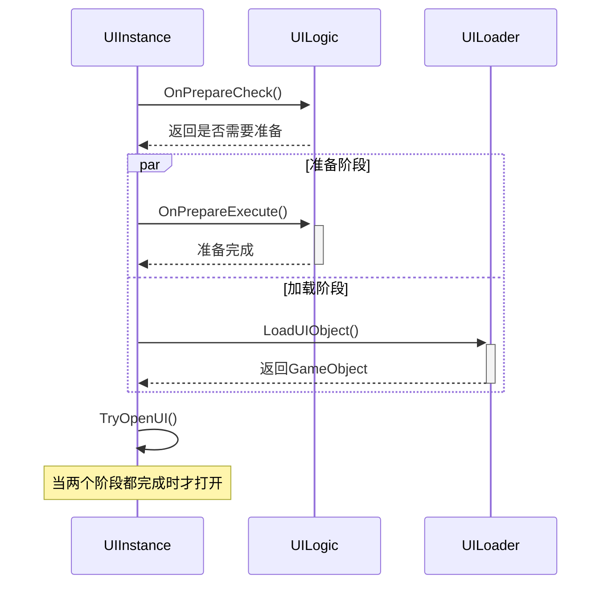
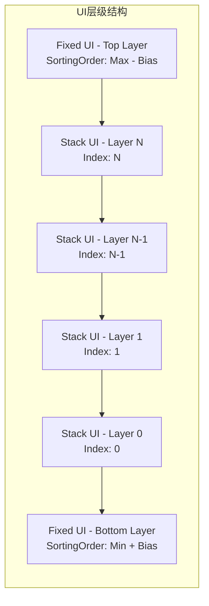
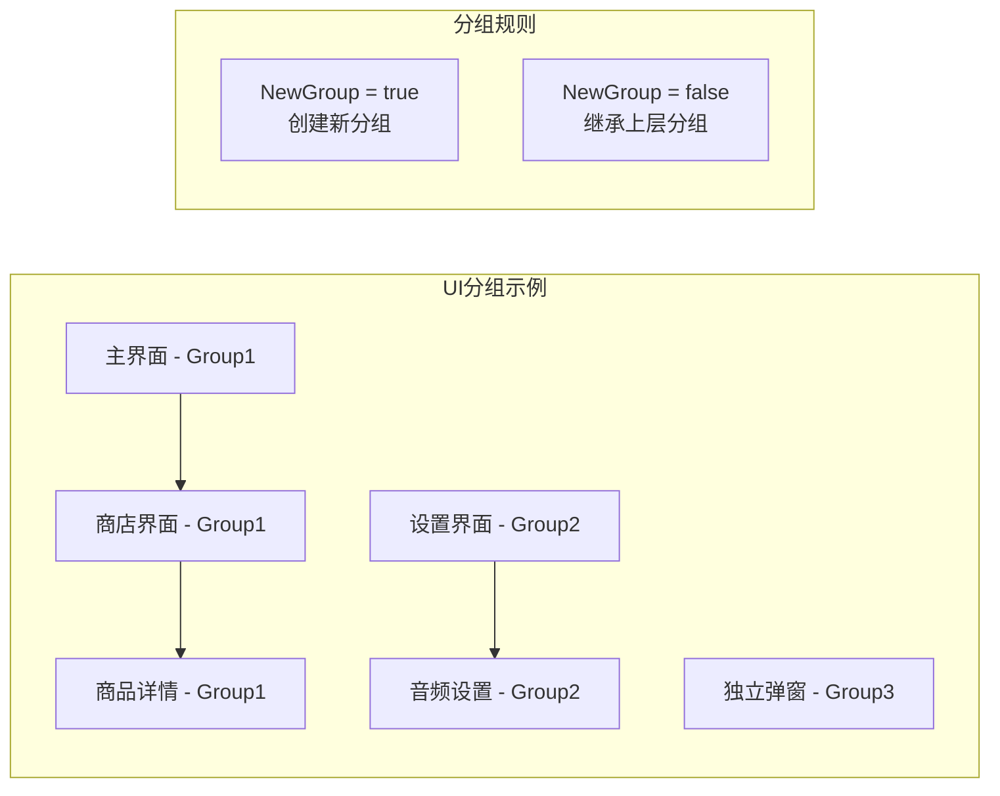
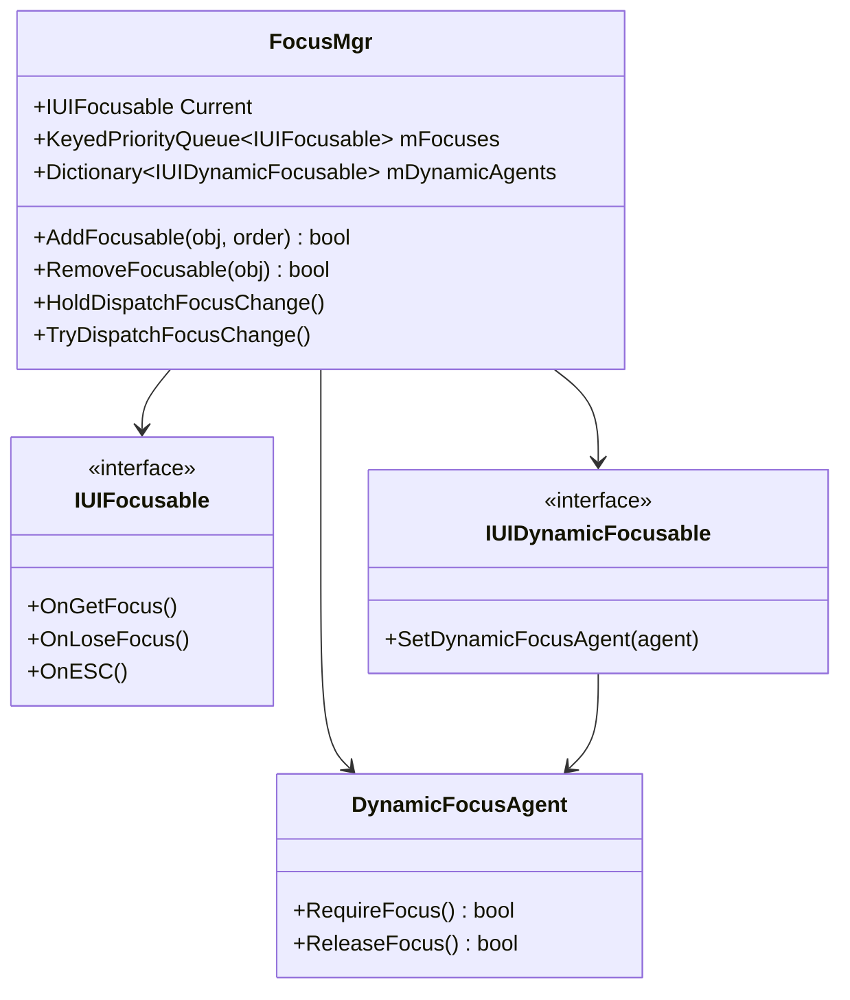

# W-Framework UI管理器详细分析

## 概述

W-Framework的UI管理器是整个框架的核心组件，提供了完整的UI生命周期管理、层级控制、焦点管理和分组操作等功能。本文档深入分析其设计原理和实现机制。

## UI管理器架构

### 核心组件

1. **UIManager** - 主管理器，提供对外接口
2. **Processor** - 内部处理器，负责UI实例管理
3. **FocusMgr** - 焦点管理器，处理UI焦点控制
4. **UIInstanceBase** - UI实例基类
   - **UIInstanceStack** - 堆叠UI实例
   - **UIInstanceFixed** - 固定UI实例

### 设计模式

- **工厂模式**: 通过UILoader创建UI实例
- **对象池模式**: Logic实例和UIInstance的缓存复用
- **状态机模式**: UI生命周期状态管理
- **观察者模式**: 焦点变化通知机制

## UI生命周期详细分析

### 完整生命周期流程图



### 状态机详解

UI实例在生命周期中会经历以下状态：

1. **None** - 初始状态
2. **Preparing** - 准备中（异步加载和准备阶段）
3. **Opened** - 已打开（正常运行状态）
4. **Closed** - 已关闭（终止状态）

### 异步处理机制

UI管理器采用双异步并行处理：



## UI层级管理系统

### 层级架构

W-Framework将UI分为两大类型：

1. **Stack UI (堆叠UI)**
   - 支持后进先出的堆叠管理
   - 支持全屏UI自动隐藏下层UI
   - 支持分组管理

2. **Fixed UI (固定UI)**
   - 固定在特定层级
   - 不受堆叠影响
   - 适用于HUD、工具栏等

### 排序规则



### 层级冲突处理

1. **互斥组冲突**: 相同MutexGroup的UI只能存在一个
2. **重复ID冲突**: 根据AllowMultiple设置决定是否关闭旧UI
3. **全屏UI处理**: 全屏UI会自动隐藏下层UI

## UI分组管理

### 分组机制



### 分组操作

- **OpenSingle**: 只关闭指定UI
- **CloseGroup**: 关闭整个分组
- **自动分组**: 根据NewGroup属性自动分配分组

## 焦点管理系统

### 焦点管理架构



### 焦点优先级

- 基于Priority Queue实现
- SortingOrder越高，焦点优先级越高
- 支持动态焦点申请和释放

## 性能优化特性

### 1. 对象池机制

```csharp
// Logic实例缓存
private static Dictionary<Type, Queue<IUILogicBase>> s_logic_cache;

// UIInstance实例缓存
private static LinkedList<T> s_caches = new LinkedList<T>();
```

### 2. 异步加载

- 并行处理准备和加载阶段
- 避免阻塞主线程
- 支持超时机制

### 3. 延迟计算

- SortingOrder和PositionZ按需计算
- 屏幕变化时才重新计算位置

### 4. 内存管理

- 自动资源清理
- GameObject及时卸载
- Logic实例复用

## 错误处理机制

### 异常安全

```csharp
try {
    Logic.OnCreate(parameter);
} catch (Exception e) {
    Debug.LogException(e);
}
```

### 容错设计

- 加载失败自动清理
- 准备超时自动关闭
- 异常不影响其他UI

## API设计亮点

### 1. 链式调用

```csharp
UIManager.OpenWithHandler(handler, "dialog", parameter);
```

### 2. 泛型约束

```csharp
private abstract class UIInstanceBase<T, U> : UIInstanceBase
    where T : UIInstanceBase<T, U>
    where U : IUILogicBase
```

### 3. 接口分离

- `IUILogicStack` - 堆叠UI接口
- `IUILogicFixed` - 固定UI接口
- `IUIFocusable` - 焦点接口
- `IUIDynamicFocusable` - 动态焦点接口

## 总结

W-Framework的UI管理器通过以下设计实现了高效的UI管理：

### 核心优势

1. **完整的生命周期管理** - 从创建到销毁的全流程控制
2. **智能层级系统** - 自动排序和冲突处理
3. **灵活的分组机制** - 支持复杂的UI组织结构
4. **高效的焦点管理** - 基于优先级队列的焦点控制
5. **异步加载机制** - 避免UI加载阻塞
6. **对象池优化** - 提升性能和内存效率
7. **异常安全设计** - 保证系统稳定性

### 设计哲学

- **职责分离** - 每个组件都有明确的职责
- **扩展性** - 通过接口和继承支持定制
- **性能优先** - 内存池和异步加载优化
- **开发友好** - 简洁的API和完善的错误处理

这使得W-Framework的UI管理器成为了一个功能强大、性能优异且易于使用的UI管理解决方案。